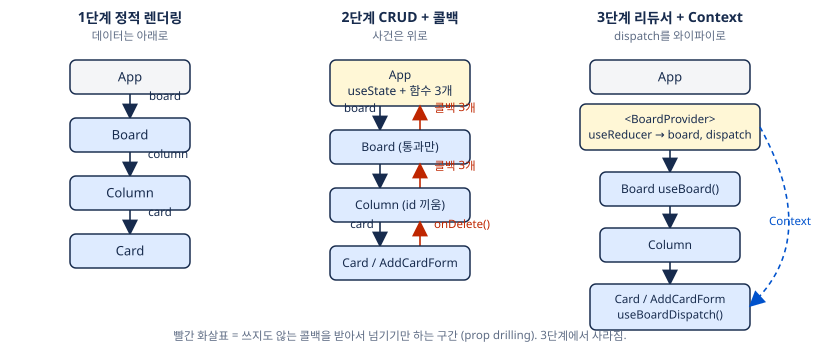

# 서문 — 이 문서는 무엇인가

## 왜 시작했나
바이브 코딩에만 의존해서 혼자 손코딩도, 면접에서 설명도 못 하는 상태를 끊기 위해 2026-09-30에 시작했다.
목표는 동작하는 결과물이 아니라 **"왜 이렇게 했는지 설명할 수 있는 실력"**이다.

## 진행 방식
- **Claude = 시니어 프론트 팀장.** 단계별 스펙 작성, 코드 리뷰, 면접 질문, 방향 제시. 코드는 원칙적으로 쓰지 않고, 막혔을 때 "틀"이나 "한 줄"만.
- **도완 = 구현자.** `kanban/src/` 아래 코드를 직접 작성. 리뷰 후 면접 질문에 답하고, 교정받는다.
- **문서는 전부 Claude가** 대화 기반으로 정리. 이 PDF가 그 결과물이다.

```
스펙 작성 → 구현 → "리뷰해줘" → 리뷰 + 면접 질문 → 답변 → 교정 → 교재/회고 정리 → 다음 단계
```

## 프로젝트: 칸반 보드 (Trello 미니 클론)
Vite + React 19 + TypeScript 6, CSS Modules. 상태 라이브러리 없음, 라우터 없음, DnD 라이브러리 없음. 전부 손으로.
저장소: `github.com/dowankim1024/frontend_practice`

왜 칸반인가: 외부 API 없이 시작 가능하고, 상태 모델링·불변 업데이트·useReducer·Context·DnD·undo/redo·낙관적 업데이트까지 면접 단골 주제가 전부 자연스럽게 나온다.

## 9단계 로드맵

| # | 주제 | 핵심 개념 | 상태 |
|---|------|-----------|------|
| 1 | 정적 보드 렌더링 | 컴포넌트 분리, props, key, 타입 설계 | 완료 (09-30) |
| 2 | 카드 CRUD | 제어 컴포넌트, 불변 업데이트, 상태 위치, 콜백 체인 | 완료 (09-30) |
| 3 | useReducer + Context | 액션 설계, 리듀서 순수성, Context 분리 | 완료 (10-01) |
| 4 | localStorage 영속화 | 커스텀 훅, useEffect 의존성, lazy init | |
| 5 | 드래그앤드롭 (네이티브) | 이벤트 흐름, dataTransfer, 드롭 위치 계산 | |
| 6 | undo/redo | 히스토리 상태 설계, 리듀서 합성 | |
| 7 | mock API + 낙관적 업데이트 | msw, 로딩/에러, 롤백 | |
| 8 | 테스트 | Vitest, Testing Library, 리듀서 단위 테스트 | |
| 9 | 성능 | Profiler, memo/useCallback을 필요한 곳에만 | |

## 이 문서 읽는 법
각 장은 **과제 → 전체 그림 → 최종 코드 전문 + 해설 → 대화에서 나온 질문과 답 → 삽질 → 팁 → 면접 문답** 순서다.
코드는 그 단계가 끝난 시점의 실제 파일 내용이다. 단계마다 코드가 어떻게 변해가는지 비교하면서 읽으면 "왜 리팩터했나"가 보인다.

## 전체 흐름 한눈에



## 단계별로 무엇이 나아졌나 (요약)

| 단계 | 추가된 능력 | 치른 비용 | 그 비용을 푸는 단계 |
|------|------------|-----------|-------------------|
| 1 | 타입이 잡힌 데이터를 화면에 그림 | — | — |
| 2 | 카드 추가/삭제/수정. 사건이 콜백으로 위로 올라감 | `Board`가 쓰지 않는 콜백 3개를 통과 (prop drilling). 변경 로직이 `App`에 묶임 | 3 |
| 3 | 변경 로직이 순수 함수(리듀서)로 분리. `dispatch` 하나를 Context로 배달. 중간층이 콜백을 모름 | `Card`가 `columnId`를 알아야 함. 리렌더 범위는 아직 그대로 | 9 |
| 4~9 | (예정) 영속화 → DnD → undo → 서버 동기화 → 테스트 → 성능 | | |

