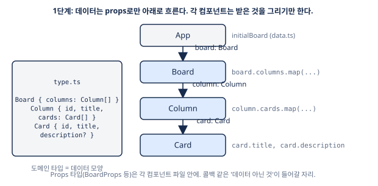
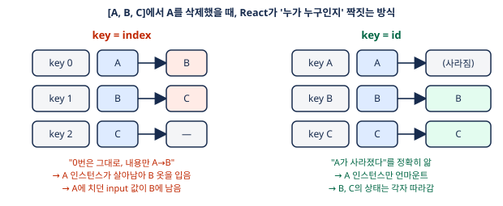

# Lesson 1 — 정적 보드 렌더링

> 이 문서는 1단계 전체를 나중에 혼자 읽어도 이해되도록 쓴 교재다. 과제 → 최종 코드 → 줄 단위 해설 → 대화에서 나온 질문 → 삽질 → 면접 문답 순서.

## 1. 과제
하드코딩된 데이터로 컬럼 3개와 카드를 화면에 그린다. 상태 변경 없음.
요구: `type.ts`에 `Card`/`Column`/`Board` 타입, `data.ts`에 초기 데이터, `Board`/`Column`/`Card` 컴포넌트 3개 + CSS Modules, `App`은 `Board`에 데이터만 넘김.

## 2. 전체 그림



데이터는 위에서 아래로 props로만 흐른다. 각 컴포넌트는 받은 것을 그리기만 한다.

### 이 단계가 만드는 출발점
아직 "나아진 것"은 없다. 대신 뒤 단계가 전부 이 위에 쌓이는 **토대 세 개**를 만든다.

| 토대 | 뒤에서 어떻게 쓰이나 |
|------|---------------------|
| 도메인 타입 `Board/Column/Card` | 2단계 상태 타입, 3단계 리듀서 시그니처, 4단계 저장 단위 |
| 컴포넌트 3개가 같은 패턴 | 2단계에서 콜백을 끼울 자리, 3단계에서 `useBoard()`로 바꿀 자리가 명확 |
| key = id | 2단계 삭제, 5단계 순서 변경에서 상태가 엉뚱한 카드에 붙는 걸 방지 |
파일 구조:
```
src/
  type.ts            도메인 타입 (데이터 모양)
  data.ts            초기 데이터
  App.tsx            상태 루트 (지금은 데이터 넘기기만)
  components/
    Board.tsx  + Board.module.css
    Column.tsx + Column.module.css
    Card.tsx   + Card.module.css
```

## 3. 최종 코드

### `src/type.ts`
```ts
export interface Card {
  id: string
  title: string
  description?: string
}
export interface Column {
  id: string
  title: string
  cards: Card[]
}
export interface Board {
  columns: Column[]
}
```

**해설**
- `Card.description?` 만 옵셔널. 설명은 정말 없을 수 있는 정보.
- `Column.cards`, `Board.columns`는 **필수**. 비어 있을 수는 있어도(`[]`) 없을 수는 없다. → 질문 Q1 참고.
- `Board`는 지금은 컬럼 묶음일 뿐이지만, 4단계(localStorage 저장 단위)·6단계(undo 단위)에서 상태의 루트가 된다.
- 데이터 모델은 **중첩 구조**(컬럼이 카드 배열을 품음)를 선택. 정규화(카드를 별도 맵으로, 컬럼은 cardIds만)보다 단순. 5단계 DnD에서 카드 이동 시 두 컬럼 배열을 동시에 갱신해야 하는 비용은 그때 체감.

### `src/data.ts`
```ts
import type { Board } from "./type";

export const initialBoard: Board = {
  columns: [
    {
      id: "100",
      title: "To Do",
      cards: [
        {
          id: "1",
          title: "공부하기"
        },
        {
          id: "2",
          title: "잠자기",
          description: "꿀잠잘것"
        }
      ]
    },
    {
      id: "200",
      title: "In Progress",
      cards: [
        {
          id: "3",
          title: "놀기"
        },
        {
          id: "4",
          title: "먹기",
          description: "먹다지침"
        }
      ]
    },
    {
      id: "300",
      title: "Done",
      cards: [
        {
          id: "5",
          title: "살기"
        },
        {
          id: "6",
          title: "태어나기",
          description: "죽지못해태어나기"
        }
      ]
    }
  ]
};
```

**해설**
- `: Board`를 붙이는 순간 모양이 틀리면 컴파일러가 잡아준다. 실제로 처음엔 배열을 그대로 넣어 `Property 'columns' is missing` 에러가 났고, `{ columns: [...] }`로 감싸서 해결.
- id는 전부 유일해야 한다. 처음에 카드 두 개가 `"5"`로 중복이었음 → key 경고와 2단계 삭제 오작동의 원인이 되므로 수정.
- 이름은 `data`가 아니라 `initialBoard`. 나중에 localStorage에서 읽은 보드와 구분돼야 한다.

### `src/components/Card.tsx`
```tsx
import type { Card as CardData } from "../type"
import styles from "./Card.module.css"

interface CardProps {
  card: CardData
}

export function Card({ card }: CardProps) {
  return (
    <div className={styles.card}>
      <h3 className={styles.title}>{card.title}</h3>
      {card.description && <p className={styles.description}>{card.description}</p>}
    </div>
  )
}
```

**해설**
- `import type { Card as CardData }` — 타입 `Card`와 컴포넌트 `Card`가 같은 이름이라 별칭. TS는 타입/값 네임스페이스가 달라 컴파일은 되지만 사람이 헷갈린다.
- `interface CardProps { card: CardData }` — **props 타입은 컴포넌트 파일 안에.** `type.ts`의 `Card`는 데이터 모양, `CardProps`는 이 컴포넌트의 입력 계약. 2단계에서 `onDelete` 같은 콜백이 여기 추가되는데, 그건 데이터가 아니다.
- `{ card }: CardProps` — 매개변수 구조분해. 중괄호 안 이름은 **타입에 실제로 있는 키**여야 한다. `{ props }`라고 쓰면 그런 키가 없어 에러.
- 카드를 통째로 받는 이유: 필드가 늘어도 부모 코드가 안 바뀌고, 5단계에서 `card.id`가 어차피 필요.
- `{card.description && <p>...</p>}` — 있을 때만 그린다. 문자열이라 안전. 숫자였다면 `0`이 찍히는 함정(Q3).
- 감싸는 `div`가 있어야 CSS 클래스를 붙일 상자가 생긴다. Fragment(`<>`)는 DOM을 안 만든다.

### `src/components/Column.tsx`
```tsx
import type { Column as ColumnData } from "../type"
import { Card } from "./Card"
import styles from "./Column.module.css"
interface ColumnProps {
  column: ColumnData
}
export function Column({ column }: ColumnProps) {
  return (
    <div className={styles.column}>
      <h2 className={styles.title}>{column.title}</h2>
      {column.cards.map((card) => <Card key={card.id} card={card} />)}
    </div>
  )
}
```

**해설**
- `Card`와 완전히 같은 패턴. 별칭 import → props 인터페이스 → 구조분해 → JSX.
- `column.cards.map((card) => <Card key={card.id} card={card} />)` — **key는 map이 반환하는 요소에.** `Card` 안쪽 div에 붙이면 배열 밖이라 React가 못 본다.
- key는 props가 아니다. `Card` 안에서 `props.key`로 못 꺼낸다.

### `src/components/Board.tsx`
```tsx
import type { Board as BoardData } from "../type"
import { Column } from "./Column"
import styles from "./Board.module.css"
interface BoardProps {
  board: BoardData
}
export function Board({ board }: BoardProps) {
  return (
    <div className={styles.board}>
      {board.columns.map((column) => <Column key={column.id} column={column} />)}
    </div>
  )
}
```

### `src/App.tsx`
```tsx
import { Board } from "./components/Board"
import { initialBoard } from "./data"
function App() {
  return (<div>
    <h1>Kanban</h1>
    <Board board={initialBoard} />
  </div>
  )
}

export default App
```

### CSS
```css
/* Board.module.css — 컬럼들을 가로로 */
/* 보드 전체. 안에 있는 컬럼들을 가로로 나열한다. */
.board {
  display: flex;
  flex-direction: row;
  align-items: flex-start;
  gap: 12px;

  padding: 16px;
  overflow-x: auto;
  min-height: 100vh;
}
```
```css
/* Column.module.css — 카드들을 세로로 */
/* 컬럼 하나. 안에 있는 카드들을 세로로 쌓는다. */
.column {
  display: flex;
  flex-direction: column;
  gap: 8px;

  width: 272px;
  flex-shrink: 0;
  padding: 12px;
  border-radius: 8px;
  background: #ebecf0;
}

.title {
  margin: 0 0 4px;
  font-size: 14px;
  font-weight: 700;
  color: #172b4d;
}
```
```css
/* Card.module.css */
.card {
  background: #fff;
  border-radius: 6px;
  padding: 8px 12px;
  box-shadow: 0 1px 2px rgba(9, 30, 66, 0.25);
}

.title {
  margin: 0;
  font-size: 14px;
  font-weight: 600;
}

.description {
  margin: 4px 0 0;
  font-size: 12px;
  color: #5e6c84;
}
```

**해설**
- **정렬 방향은 자식이 아니라 부모에.** 카드를 세로로 쌓으려면 카드가 아니라 카드를 담은 `.column`에 `flex-direction: column`. 컬럼을 가로로 놓으려면 `.board`에 `row`.
- `gap`으로 자식 간 간격. 각 자식에 margin 주는 것보다 깔끔.
- CSS Modules: 파일명이 `*.module.css`면 Vite가 클래스명을 고유하게 바꿔준다. `styles.card`로 접근.

## 4. 대화에서 나온 질문과 답

**Q1. 카드가 없는 컬럼이 있을 수 있으니 `cards?`로 해야 하지 않나?**
아니다. "카드 0개"는 `cards: []`로 이미 표현된다. `?`는 "필드 자체가 없을 수 있다(`undefined`)"는 뜻이라 상태를 하나 더 만드는 것. `[].map()`은 조용히 아무것도 안 그리지만 `undefined.map()`은 터진다. `?`는 오류를 막는 게 아니라 방어 코드를 강제한다.
→ "비어 있을 수 있나"면 빈 값, "없을 수 있나"면 `?`.

**Q2. `Board`의 역할이 뭔가? 컬럼 묶음 이상이 아닌데.**
지금은 그렇다. 하지만 4단계에서 "무엇을 저장하나"의 답, 6단계에서 "무엇으로 되돌리나"의 답이 `Board` 하나가 된다. 상태 루트 자리를 미리 잡아두는 것.

**Q3. "props 타입을 만들라"는 게 `type.ts` 이름을 `CardProps`로 바꾸라는 건가?**
아니다. 도메인 타입(데이터 모양)과 props 타입(컴포넌트 입력 계약)은 다른 개념. props에는 콜백처럼 데이터가 아닌 것도 들어간다. `type.ts`는 그대로 두고 `CardProps`는 `Card.tsx` 안에 따로 선언.

**Q4. 정렬 방향을 어디에 쓰나?**
자식이 아니라 부모 컨테이너에. 위 CSS 해설 참고.

**Q5. index를 key로 쓰면 "리렌더가 안 된다"는 건가?**



아니다. 리렌더는 되는데 **잘못된 짝으로** 된다. `[A,B,C]`에서 A 삭제 → `[B,C]`. index key면 React는 "0번은 그대로 있고 내용만 A→B로 바뀜"으로 본다. A 인스턴스가 살아남아 B 옷을 입고, A에 치던 input 값이 B에 남는다. id key면 "A가 사라졌다"를 정확히 알고 A만 언마운트.

## 5. 삽질 기록
| 증상 | 원인 | 해결 |
|------|------|------|
| `cards?`, `columns?` 로 선언 | "비어 있음"과 "없음" 혼동 | 필수로 변경 |
| `data.ts` 최상위가 배열 | `Board`는 `{ columns }` 객체 | 감싸기. 에러 메시지의 `Property 'columns' is missing`이 답 |
| 카드 id `"5"` 중복 | 복붙 | 유일하게 |
| `type.ts` 이름을 전부 `XxxProps`로 변경 | 도메인/props 타입 혼동 | 되돌리고 `CardProps`는 컴포넌트 파일에 |
| `function Card({ props }: CardProps)` | 구조분해 키를 임의로 지음 | 타입에 있는 키 `{ card }` |
| `Column.moudle.css` 파일명 오타 | 오타 | import가 못 찾음. 파일명 수정 |
| `{description && <p></p>}` | 조건은 맞는데 내용이 비어 있음 | `<p>{description}</p>` |

## 6. 팁
- **TS 에러 읽는 법:** `missing`, `not assignable` 앞뒤의 타입 이름과 속성 이름을 찾아 `type.ts`와 대조.
- **타입 먼저, 데이터 나중:** `const x: Board = ...`로 타입을 먼저 붙이면 에디터가 빠진 필드를 바로 알려준다.
- **작은 것부터:** `Card` → `Column` → `Board`. 작은 컴포넌트가 완성돼야 큰 컴포넌트가 그걸 쓸 수 있다.
- **같은 패턴 반복:** 세 컴포넌트가 똑같은 모양(별칭 import → Props 인터페이스 → 구조분해 → JSX)이면 읽는 사람이 편하다.

## 7. 면접 문답 (실제 답변 + 교정)
**Q. index를 key로 쓰면 언제 문제가 생기나?**
답변: "요소가 삭제되거나 추가될 때 key가 계속 바뀜. 정렬이 이상해질 것 같다."
교정: 방향은 맞다. 정확히는 key가 자리에 붙어서, 삭제·정렬 시 항목의 로컬 상태가 엉뚱한 항목에 남고 불필요한 리렌더가 생긴다.
모범답안: "key는 배열 렌더링에서 이전 요소와 새 요소를 짝짓는 식별자입니다. index를 쓰면 key가 항목이 아니라 자리에 붙어서, 삭제나 정렬 시 로컬 상태가 엉뚱한 항목에 남고 불필요한 리렌더가 생깁니다. 그래서 안정적인 id를 씁니다."

**Q. props 타입을 `type.ts`가 아니라 컴포넌트 파일에 둔 이유는?**
답변: "데이터 인터페이스와 컴포넌트 인터페이스는 다르다. 컴포넌트엔 나중에 상태 같은 props가 추가될 수 있다."
교정: 맞다. "응집도"라는 단어를 쓰면 좋다. 그 컴포넌트만 쓰는 타입은 그 파일 옆에.

**Q. `{card.description && <p>}`에서 description이 숫자 0이었다면?**
답변: "타입 에러가 먼저 날 것 같고, 아니라면 0이 찍힐 듯."
교정: 정확. `&&`는 왼쪽이 falsy면 왼쪽 값을 반환하고 React는 숫자 0을 그린다. 해결은 `!!x &&` 또는 삼항.
